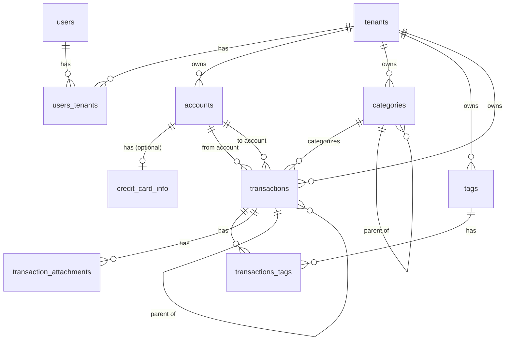

# FinTrack Core - Implemented Features

This document provides a comprehensive overview of all implemented features in FinTrack Core, organized by functional area.

---

## 🏗️ Infrastructure & Configuration

### Project Structure

- **Architecture**: Clean Architecture implementation with clear separation of concerns
  - **Domain Layer**: Pure Go entities and repository interfaces with no external dependencies
  - **Service Layer**: Business logic orchestration, framework-agnostic
  - **API Layer**: HTTP transport layer using Gin framework
  - **Database Layer**: PostgreSQL implementation using `pgx`
- **Configuration Management**: Environment-based configuration via `.env` files
- **Build Automation**: Comprehensive Makefile with commands for:
  - Database migrations (apply, rollback, create new)
  - Docker composition
  - Code tidying and testing
  - Swagger documentation generation
  - Git hooks installation

### Database Infrastructure

- **Migration System**: [tern](https://github.com/jackc/tern) for version-controlled schema changes
- **Migrations Workflow**:
  - `make migrate` - Apply migrations locally
  - `make rollback` - Rollback last migration
  - `make new-migration name=xxx` - Create new migration file
- **Immutable History**: Migration files are never modified after application
- **Audit Trail**: All migrations tracked with version numbers and timestamps

### Docker Support

- **Containerization**: Full Docker and Docker Compose support for development
- **Services**:
  - PostgreSQL database with automatic initialization
  - API server with hot-reload support
  - Migration service for automated schema updates
- **Commands**: `make compose` starts entire stack with database and migrations

### API Documentation

- **OpenAPI 3.0**: Auto-generated documentation from code annotations
- **Interactive UI**: Scalar UI for exploring and testing endpoints
- **Endpoints**:
  - Documentation UI: `http://localhost:8080/docs`
  - OpenAPI Spec: `http://localhost:8080/swagger.yaml`
- **Update Command**: `make swagger` regenerates documentation after code changes

### Health Monitoring

- **Health Check Endpoint**: `GET /health`
  - Returns API status and version information
  - Used for container orchestration and monitoring

---

## 🔐 Authentication & Authorization

### Supabase Authentication Integration

- **Provider**: Supabase Auth for secure identity management
- **Token Type**: JWT (JSON Web Tokens)
- **Validation**: Server-side JWT validation using Supabase's JWKS endpoint
- **User Mapping**: Users linked via `supabase_id` column in database

### Authentication Middleware

- **Implementation**: `AuthMiddleware` in `/internal/api/middleware`
- **Flow**:
  1. Extracts Bearer token from `Authorization` header
  2. Validates JWT signature and expiration
  3. Verifies token against Supabase JWKS
  4. Injects authenticated user context into request
- **Error Handling**: Returns `401 Unauthorized` for invalid or missing tokens

### Authorization Endpoints

#### User Registration

- **Endpoint**: `POST /auth/register`
- **Security**: Public endpoint (no authentication required)
- **Input**: Email, password, name
- **Process**: Proxies request to Supabase Auth
- **Response**: User object with authentication tokens

#### User Login

- **Endpoint**: `POST /auth/login`
- **Security**: Public endpoint
- **Content Type**: `multipart/form-data`
- **Input**: Email and password
- **Process**: Validates credentials via Supabase
- **Response**: JWT access and refresh tokens

---

## 🏢 Multi-Tenancy

### Tenant Isolation

- **Enforcement**: Strict multi-tenancy via request headers
- **Header Required**: `X-Tenant-ID` (UUID format)
- **Validation**: `TenantMiddleware` verifies tenant existence in database
- **Context Injection**: Valid tenant IDs injected into request context
- **Error Handling**: Returns `401 Unauthorized` for invalid/missing tenant ID

### Tenant Management

#### Create Tenant

- **Endpoint**: `POST /tenants`
- **Security**: Requires authentication
- **Input**: Tenant name
- **Process**:
  1. Creates new tenant record
  2. Automatically associates creator as tenant member
  3. Returns tenant details
- **Use Case**: Onboarding new organizations/workspaces

#### List User's Tenants

- **Endpoint**: `GET /users/tenants`
- **Security**: Requires authentication
- **Response**: Array of all tenants the authenticated user belongs to
- **Use Case**: Tenant selection in multi-tenant applications

### Data Isolation

- **Repository Level**: All queries automatically filter by `tenant_id`
- **Service Level**: Tenant ID extracted from context and passed to repositories
- **Validation**: Related entities (accounts, categories, tags) verified to belong to same tenant
- **Foreign Keys**: Database-level constraints ensure referential integrity

---

## 👤 User Management

### User Profile

#### Get User Profile

- **Endpoint**: `GET /users/profile`
- **Security**: Requires authentication
- **Response**: User details (ID, name, email, timestamps)
- **Data Source**: Fetched from local database, not Supabase

#### Update User Profile

- **Endpoint**: `PUT /users/profile`
- **Security**: Requires authentication
- **Input**: Name (email cannot be changed via this endpoint)
- **Process**:
  1. Validates user exists
  2. Updates name in database
  3. Sets `updated_at` timestamp
- **Response**: Updated user object

### User-Tenant Association

- **Join Table**: `users_tenants` enables many-to-many relationships
- **Features**:
  - Soft delete support via `deactivated_at`
  - Audit timestamps (`created_at`, `updated_at`)
  - Prevents duplicate associations via composite primary key
- **Access Control**: Users can only access resources from tenants they belong to

---

## 💰 Account Management

### Account Types

Supports diverse financial account types:

- **Bank**: Traditional checking/savings accounts
- **Cash**: Physical cash holdings
- **Credit Card**: Credit card accounts (with extended metadata support)
- **Investment**: Investment portfolios and brokerage accounts
- **Other**: Custom account types

### Account Features

#### Create Account

- **Endpoint**: `POST /accounts`
- **Security**: Requires authentication and tenant context
- **Input**:
  - Name (e.g., "Chase Checking")
  - Type (enum: bank, cash, credit_card, investment, other)
  - Initial balance (decimal, 2 decimal places)
  - Currency (ISO 4217 code: USD, BRL, EUR, etc.)
  - Color (RGBA hex: `#ffAABB11`)
  - Icon (emoji or icon identifier, max 256 chars)
- **Auto-Population**:
  - `tenant_id`: From request context
  - `created_by`/`updated_by`: Authenticated user ID
  - Timestamps: Current server time
- **Validation**: Domain-level validation ensures all required fields present

#### List Accounts

- **Endpoint**: `GET /accounts`
- **Security**: Requires authentication and tenant context
- **Filtering**: Automatically scoped to current tenant
- **Soft Delete**: Excludes deactivated accounts
- **Response**: Array of account objects with full details

#### Update Account

- **Endpoint**: `PUT /accounts/{id}`
- **Security**: Requires authentication and tenant context
- **Validation**: Verifies account belongs to current tenant
- **Updatable Fields**: Name, type, initial balance, currency, color, icon
- **Audit**: Updates `updated_by` and `updated_at`

#### Delete Account (Soft)

- **Endpoint**: `DELETE /accounts/{id}`
- **Security**: Requires authentication and tenant context
- **Behavior**: Sets `deactivated_at` and `deactivated_by`, preserves data
- **Rationale**: Maintains transaction history and audit trail

### Credit Card Metadata

- **Table**: `credit_card_info` (one-to-one with accounts)
- **Fields**:
  - Last four digits of card number
  - Card name (e.g., "Chase Sapphire Reserve")
  - Brand (visa, mastercard, amex, discover, jcb, unionpay, diners_club, maestro, unknown)
  - Closing date (day of month statement closes)
  - Due date (day of month payment is due)
- **Audit Trail**: Full tracking with created/updated/deactivated by/at
- **Use Case**: Statement generation and payment scheduling

---

## 🏷️ Classification System

### Categories

#### Category Features

- **Hierarchical**: Support for parent-child relationships (e.g., "Food" → "Restaurants")
- **Visual Identity**: Each category has color and icon
- **Tenant Scoped**: Categories isolated per tenant

#### Category Endpoints

##### Create Category

- **Endpoint**: `POST /categories`
- **Security**: Requires authentication and tenant context
- **Input**:
  - Name (e.g., "Groceries")
  - Parent category ID (optional, for subcategories)
  - Color (RGBA hex)
  - Icon (emoji or identifier)
- **Validation**:
  - Parent category must belong to same tenant (if specified)
  - Name required and non-empty
- **Auto-Population**: Tenant ID from context, audit fields

##### List Categories

- **Endpoint**: `GET /categories`
- **Security**: Requires authentication and tenant context
- **Filtering**: Tenant-scoped, excludes soft-deleted
- **Response**: All categories with parent references

##### Get Category by ID

- **Endpoint**: `GET /categories/{id}`
- **Security**: Requires authentication and tenant context
- **Validation**: Verifies category belongs to tenant
- **Response**: Single category object

##### Update Category

- **Endpoint**: `PUT /categories/{id}`
- **Security**: Requires authentication and tenant context
- **Updatable**: Name, parent category, color, icon
- **Validation**: Parent category ownership verification

##### Delete Category (Soft)

- **Endpoint**: `DELETE /categories/{id}`
- **Security**: Requires authentication and tenant context
- **Behavior**: Soft delete via `deactivated_at`

### Tags

#### Tag Features

- **Flexible Labeling**: Free-form tags for additional transaction metadata
- **On-the-fly Creation**: Create new tags directly within transaction forms if the tag doesn't exist
  - Flow: Filter -> "Add [Tag]" -> API Create -> Reload -> Auto-select
- **Many-to-Many**: Transactions can have multiple tags
- **Lightweight**: Minimal schema (ID, name, tenant, deactivation)

#### Tag Endpoints

##### Create Tag

- **Endpoint**: `POST /tags`
- **Security**: Requires authentication and tenant context
- **Input**: Tag name (e.g., "tax-deductible", "reimbursable")
- **Auto-Population**: Tenant ID from context

##### List Tags

- **Endpoint**: `GET /tags`
- **Security**: Requires authentication and tenant context
- **Filtering**: Tenant-scoped, excludes deactivated
- **Response**: Array of tag objects

##### Get Tag by ID

- **Endpoint**: `GET /tags/{id}`
- **Security**: Requires authentication and tenant context
- **Validation**: Verifies ownership

##### Update Tag

- **Endpoint**: `PUT /tags/{id}`
- **Security**: Requires authentication and tenant context
- **Updatable**: Name only

##### Delete Tag (Soft)

- **Endpoint**: `DELETE /tags/{id}`
- **Security**: Requires authentication and tenant context
- **Behavior**: Soft delete, removes from future queries

---

## 💸 Transaction Management

### Transaction Types

- **Credit**: Money coming into an account (income, refunds)
- **Debit**: Money leaving an account (expenses)
- **Transfer**: Moving money between accounts (internal)
- **Payment**: Paying off balances (e.g., credit card payment)

### Transaction Core Features

#### Create Transaction

- **Endpoint**: `POST /transactions`
- **Security**: Requires authentication and tenant context
- **Input**:
  - Amount (positive decimal)
  - Transaction type (credit, debit, transfer, payment)
  - From account ID (source account)
  - To account ID (optional, for transfers/payments)
  - Category ID
  - Tag IDs (array, optional)
  - Currency (ISO 4217 code)
  - Due date
  - Payment date (optional, null means unpaid)
  - Accrual month (YYYYMM format, defaults to due date's month)
  - Comments (optional)
- **Validation**:
  - All accounts and categories must belong to same tenant
  - Tags must belong to tenant
  - Amount must be positive
  - From account is required
- **Auto-Population**:
  - Tenant ID from context
  - Created/updated by/at fields
  - Accrual month defaults to due date's month if not specified

#### List Transactions

- **Endpoint**: `GET /transactions`
- **Security**: Requires authentication and tenant context
- **Filtering**: Tenant-scoped, excludes soft-deleted
- **Response**: Array with embedded tags

#### Get Transaction by ID

- **Endpoint**: `GET /transactions/{id}`
- **Security**: Requires authentication and tenant context
- **Response**: Transaction with full tag details

#### Update Transaction

- **Endpoint**: `PUT /transactions/{id}`
- **Security**: Requires authentication and tenant context
- **Updatable**: All fields except ID, tenant, timestamps
- **Tag Management**: Replaces all tags (upsert pattern)
- **Validation**: Same ownership checks as create

#### Delete Transaction (Soft)

- **Endpoint**: `DELETE /transactions/{id}`
- **Security**: Requires authentication and tenant context
- **Behavior**: Sets deactivated_at and deactivated_by

### Advanced Transaction Logic

#### Credit Card Installments

- **Feature**: Automatic splitting of purchases into multiple installments
- **Input Parameters**:
  - Base transaction details
  - Number of installments (integer)
  - Accrual month (starting month)
- **Calculation Logic**:
  - Divides amount by number of installments
  - First installment absorbs rounding remainder
  - Example: R$10.00 ÷ 3 → R$3.34, R$3.33, R$3.33
  - Total always equals original amount exactly
- **Due Date Logic**:
  - Each installment: accrual month + 1 month
  - Handles month-end edge cases (31st → 28th/29th in Feb)
- **Domain Implementation**: `installment_calculator.go` handles all split logic

#### Recurring Transactions

- **Support**: Schema prepared for recurring/subscription transactions
- **Parent-Child Model**: `parent_transaction_id` links related transactions
- **Use Cases**: Subscriptions, recurring bills, split payments

#### Payment Tracking

- **Payment Date Field**: Tracks when transaction was actually paid
- **Unpaid Status**: Null `payment_date` indicates pending payment
- **Credit Card Logic**: Payment date defaults to due date except for Payment transactions

---

## 🌐 CORS (Cross-Origin Resource Sharing)

### CORS Configuration

- **Middleware**: `gin-contrib/cors` package
- **Allowed Origins**:
  - Development: `http://localhost:4200` (Angular dev server)
  - Production: Configurable via environment
- **Allowed Methods**: GET, POST, PUT, DELETE, OPTIONS
- **Allowed Headers**:
  - `Origin`
  - `Content-Type`
  - `Authorization` (for JWT tokens)
  - `X-Tenant-ID` (for multi-tenancy)
- **Credentials**: Enabled (supports cookies and auth tokens)
- **Configuration Location**: `internal/api/router/router.go`

---

## 🗄️ Data Management

### Soft Delete Strategy

#### Traceable Deletion (Financial Entities)

Applied to: Accounts, Transactions, Attachments, Credit Card Info

- **Fields**:
  - `deactivated_at` (timestamp of deletion)
  - `deactivated_by` (UUID of user who deleted)
- **Purpose**: Full audit trail and accountability

#### Standard Soft Delete (Operational Entities)

Applied to: Users, Tenants, Tags, Categories

- **Field**: `deactivated_at` only
- **Purpose**: Preserve data integrity without full traceability

#### Repository Pattern

- **Read Operations**: Automatically filter `WHERE deactivated_at IS NULL`
- **Delete Operations**: Set `deactivated_at = NOW()` instead of hard delete
- **Join Tables**:
  - `users_tenants`: Soft delete (has timestamps)
  - `transactions_tags`: Hard delete (lightweight, no audit requirement)

### Data Integrity

#### Domain Validation

- **Implementation**: `IsValid()` method on all entities
- **Checks**:
  - Required fields present
  - Numeric values valid (non-negative balances, positive amounts)
  - String length constraints
  - Format validation (currency codes, color codes)
- **Enforcement**: Validation before persistence

#### Database Constraints

- **Foreign Keys**: All relationships enforced at database level
- **Unique Indexes**: Prevent duplicate data
- **Not Null**: Required fields enforced
- **Check Constraints**: Data type validation (enums)

### Audit Trail

#### Timestamp Management

- **Created At**: Auto-populated on insert
- **Updated At**: Explicitly set in UPDATE queries (no triggers)
- **Return Policy**: Timestamps returned via `RETURNING` clause for client sync

#### User Tracking

- **Created By**: User who created the record
- **Updated By**: User who last modified the record
- **Deactivated By**: User who soft-deleted the record (financial entities only)

#### Database Schema



---

## 🧪 Testing

### Testing Infrastructure

- **Framework**: Go standard testing package
- **Mocking**: `pgxmock` for database layer testing
- **Command**: `make test` runs all tests
- **Coverage**: Unit tests for repository layer implemented

### Test Strategy

- **Unit Tests**: Service layer with mocked repositories
- **Integration Tests**: Handlers with test database (planned)
- **Target Coverage**: >80% (roadmap goal)

---

## 📦 Database Schema Overview

### Core Entities

1. **Tenants**: Organizations/workspaces
2. **Users**: Individual user accounts
3. **Users_Tenants**: Many-to-many user-tenant relationships
4. **Accounts**: Financial accounts (bank, cash, credit card, etc.)
5. **Credit_Card_Info**: Extended metadata for credit card accounts
6. **Categories**: Hierarchical expense/income categories
7. **Tags**: Flexible labels for transactions
8. **Transactions**: Financial movements between accounts
9. **Transactions_Tags**: Many-to-many transaction-tag relationships
10. **Transaction_Attachments**: File attachments for transactions (schema ready)

### Enums

- **account_type**: bank, cash, credit_card, investment, other
- **credit_card_brand**: visa, mastercard, amex, discover, jcb, unionpay, diners_club, maestro, unknown
- **transaction_type**: credit, debit, transfer, payment

### Indexes

- **Performance Optimization**:
  - Tenant ID indexes on all multi-tenant tables
  - Account ID index on credit card info
  - Transaction ID index on attachments
  - Accrual month and transaction type indexes on transactions
  - Composite unique index on credit card per account

---

## 🚀 Deployment

### Development Workflow

```bash
# Start entire stack
make compose

# Run migrations only
make migrate

# Create new migration
make new-migration name=add_feature_x

# Run tests
make test

# Update API docs
make swagger

# Clean dependencies
make tidy
```

### Production Considerations

- **CORS**: Update allowed origins in router configuration
- **Environment Variables**: Configure via `.env.prod`
- **Database**: PostgreSQL 12+ required
- **Migrations**: Run via Docker migration service or `make migrate`

---

## 📚 Related Documentation

- [ROADMAP.md](file:///Users/igoventura/Developer/Personal/fintrack-api/ROADMAP.md) - Feature implementation status and priorities
- [PROJECT_STRUCTURE.md](file:///Users/igoventura/Developer/Personal/fintrack-api/PROJECT_STRUCTURE.md) - Codebase organization and architecture
- [GUIDELINES.md](file:///Users/igoventura/Developer/Personal/fintrack-api/GUIDELINES.md) - Development standards and workflows
- [README.md](file:///Users/igoventura/Developer/Personal/fintrack-api/README.md) - Getting started and setup instructions

---

## 🎯 Feature Status Summary

| Phase          | Feature                    | Status         | Completion |
| -------------- | -------------------------- | -------------- | ---------- |
| Phase 1        | Project Structure          | ✅ Complete    | 100%       |
| Phase 1        | Database & Migrations      | ✅ Complete    | 100%       |
| Phase 1        | Authentication             | ✅ Complete    | 100%       |
| Phase 1        | Multi-Tenancy              | ✅ Complete    | 100%       |
| Phase 1        | User Management            | ✅ Complete    | 100%       |
| Phase 1        | Accounts                   | ✅ Complete    | 100%       |
| Phase 2        | Categories                 | ✅ Complete    | 100%       |
| Phase 2        | Tags                       | ✅ Complete    | 100%       |
| Phase 3        | Transactions               | ✅ Complete    | 100%       |
| Phase 3        | Installment Logic          | ✅ Complete    | 100%       |
| Phase 4        | Credit Card Management     | 🚧 Schema Only | 20%        |
| Phase 4        | Reporting                  | ⏳ Planned     | 0%         |
| Phase 4        | Invitations                | ⏳ Planned     | 0%         |
| Phase 4        | Attachments                | 🚧 Schema Only | 20%        |
| Infrastructure | Docker & API Docs          | ✅ Complete    | 100%       |
| Infrastructure | CI/CD                      | ⏳ Planned     | 0%         |
| Infrastructure | Unit Tests                 | 🚧 Partial     | 30%        |
| **Web App**    | **Phase 6: User Profile**  | ✅ Complete    | 100%       |
| **Web App**    | **Phase 7: Accounts**      | ✅ Complete    | 100%       |
| **Web App**    | **Phase 8: Categories**    | ✅ Complete    | 100%       |
| **Web App**    | **Phase 9: Tags**          | ✅ Complete    | 100%       |
| **Web App**    | **Phase 10: Transactions** | ⏳ Planned     | 0%         |

**Overall Progress**: Core API (Phase 1-3) ✅ | Web App (Phase 6-9) ✅ | Phase 4 & 10 🚧
